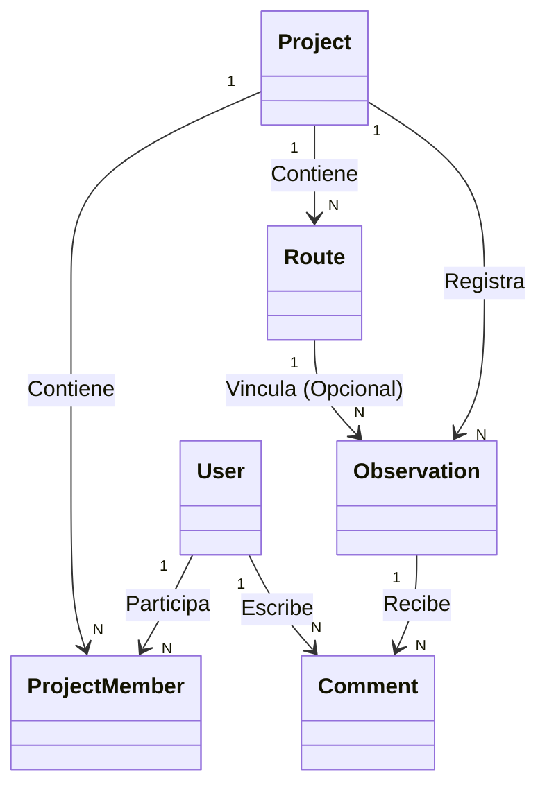

# Capítulo 4: Metodología y Resultados

En este capítulo se detalla el ciclo de vida de desarrollo de software utilizado, el análisis de requisitos de los usuarios del sistema, los diagramas de diseño fundamentales de la base de datos y la arquitectura, así como los resultados prácticos obtenidos en la implementación y las estrategias de despliegue.

## 4.1.- PLANIFICACIÓN DEL PROYECTO

El desarrollo de BioField se ha planificado siguiendo un enfoque iterativo e incremental basado en la metodología ágil **Scrum**. Esta elección metodológica permitió adaptar las funcionalidades del sistema basándose en pruebas continuas en dispositivos físicos e interfaces web.

El cronograma del proyecto se estructuró en 4 hitos o fases principales:
1. **Fase de Análisis e Investigación (Semanas 1-2)**: Investigación del estado del arte, comparación de herramientas existentes, selección de la pila tecnológica (Dart/Flutter, C#/.NET 9, React/Vite) y modelado de datos conceptual.
2. **Fase de Desarrollo Core & Backend (Semanas 3-6)**: Creación de la base de datos PostgreSQL, APIs de autenticación de Google y sincronización. Implementación del almacenamiento local Drift en el cliente móvil.
3. **Fase de Clientes e Interfaz (Semanas 7-10)**: Desarrollo de la UI en Flutter, mapas interactivos locales, panel de administración React, integración de MapLibre 3D y APIs de Inteligencia Artificial (Gemini).
4. **Fase de Refinamiento, Pruebas y Despliegue (Semanas 11-12)**: Pruebas unitarias y de integración, depuración de sincronización sin red (offline-first), pulido estético de la webapp, empaquetado en contenedores Docker y redacción de la memoria.

## 4.2.- CAPTURA DE REQUISITOS

El sistema distingue tres roles de usuario principales:
* **Administrador de Sistema (Admin)**: Usuario con privilegios elevados en el panel web. Puede auditar todos los usuarios del sistema, cambiar roles (de User a Admin y viceversa), y supervisar las estadísticas globales (proyectos totales, observaciones, etc.).
* **Propietario/Editor de Proyecto (Investigador)**: Puede crear proyectos ecológicos, invitar a colaboradores compartiendo el `shareCode` único, crear/modificar rutas, registrar notas y observaciones, exportar datos e interactuar en el panel web y móvil.
* **Visualizador/Colaborador**: Usuario que se une a un proyecto existente mediante el código compartido. Puede registrar nuevas observaciones en el campo desde su móvil y consultar los mapas de proyectos compartidos.

### Requisitos Funcionales Principales (RF)
* **RF-1 (Autenticación)**: El usuario debe poder iniciar sesión en el ecosistema utilizando únicamente su cuenta oficial de Google (OAuth2).
* **RF-2 (Gestión de Proyectos)**: Los usuarios pueden crear proyectos y unirse a proyectos de otros mediante un código alfanumérico único.
* **RF-3 (Registro de Observaciones)**: Debe permitir registrar un espécimen con título, taxonomía, coordenadas geográficas (capturadas por GPS), altitud, clima (temperatura, humedad, condición de nubosidad), descripción del hábitat, notas y fotografías.
* **RF-4 (Trazado de Rutas)**: La app móvil debe capturar de forma continua la posición GPS para registrar rutas de muestreo y asociarlas a observaciones.
* **RF-5 (Sincronización Offline)**: Los datos guardados sin conexión en la app móvil deben sincronizarse automáticamente con el servidor al detectar red.
* **RF-6 (Visualización en 3D)**: La webapp debe ofrecer una simulación 3D interactiva que reproduzca el recorrido del trayecto y resalte los puntos donde se tomaron observaciones.
* **RF-7 (Exportación)**: Debe ser posible exportar los datos recolectados en formatos CSV, GeoJSON, GPX, PDF y Excel.

## 4.3.- DISEÑO Y BASE DE DATOS

El diseño del modelo de base de datos relacional de BioField se estructuró para soportar la integridad relacional y facilitar la sincronización offline.

### 4.3.1.- Modelo Entidad-Relación (Relacional)
El esquema de PostgreSQL implementa las siguientes relaciones clave:
* **Users** (Usuarios): Almacena la información de perfil obtenida de Google (`GoogleId`, `Email`, `DisplayName`, `AvatarUrl`) y metadatos adicionales (`Speciality`, `Institution`, `Role`).
* **Projects** (Proyectos): Contiene los datos del proyecto (`Name`, `Description`, `ShareCode`, `CoverImageUrl`, `IsArchived`).
* **ProjectMembers** (Miembros del Proyecto): Tabla intermedia N a N que vincula usuarios con proyectos con roles específicos (`owner`, `editor`, `viewer`).
* **Routes** (Rutas): Representa recorridos de GPS asociados a un proyecto y un usuario. Guarda la serie de puntos geoespaciales en un formato serializado JSON (`TrackPointsJson`), la distancia total y la duración.
* **Observations** (Observaciones): Entidad principal del sistema. Vincula una observación a un `Project` y, opcionalmente, a una `Route`. Contiene todos los campos biológicos, climáticos y de hábitat descritos, y la lista de fotos serializada en JSON.
* **Comments** (Comentarios): Vincula comentarios de usuarios a observaciones individuales, fomentando la colaboración científica.

### Diagrama de Relaciones UML simplificado


## 4.4.- IMPLEMENTACIÓN Y CÓDIGO CLAVE

A continuación se exponen fragmentos y explicaciones de las partes más críticas del sistema:

### 4.4.1.- Control de Sincronización (Offline-First en C# / Entity Framework Core)
Para evitar que se sobrescriban registros accidentalmente durante la sincronización, el backend expone un endpoint `/api/sync` que recibe listas de observaciones y las integra mediante transacciones controladas por el estado de sincronización (`SyncStatus`):

```csharp
// Fragmento lógico conceptual en el Backend
public async Task<SyncResponseDto> SyncObservationsAsync(Guid userId, List<ObservationSyncDto> localObsList)
{
    foreach (var local in localObsList)
    {
        var existing = await _context.Observations.FindAsync(local.Id);
        if (existing == null)
        {
            // Insertar nueva observación subida desde el móvil
            var newObs = new Observation {
                Id = local.Id,
                ProjectId = local.ProjectId,
                UserId = userId,
                TaxonName = local.TaxonName,
                Latitude = local.Latitude,
                Longitude = local.Longitude,
                ObservedAt = local.ObservedAt,
                SyncStatus = SyncStatus.Synced, // Confirmado en servidor
                PhotosJson = local.PhotosJson
            };
            _context.Observations.Add(newObs);
        }
        else
        {
            // Resolución de conflictos simple por fecha de actualización
            if (local.UpdatedAt > existing.UpdatedAt)
            {
                existing.TaxonName = local.TaxonName;
                existing.Latitude = local.Latitude;
                existing.Longitude = local.Longitude;
                existing.UpdatedAt = DateTime.UtcNow;
                existing.SyncStatus = SyncStatus.Synced;
            }
        }
    }
    await _context.SaveChangesAsync();
}
```

### 4.4.2.- Interpolación y Física de Cámara 3D (Turf.js / React)
En el panel web, para lograr un movimiento continuo e inmersivo del recorrido sobre el mapa tridimensional acelerado por WebGL (MapLibre), se utiliza Turf.js para interpolar el trayecto geográfico en incrementos de 5 metros, aplicando física de amortiguación a la cámara:

```typescript
// Fragmento lógico de animación de cámara en Map3D.tsx
let targetZoom = autoCamera ? getAutoCameraParams(currentSegmentDist).zoom : zoomLevel;
let targetPitch = autoCamera ? getAutoCameraParams(currentSegmentDist).pitch : lookAheadPitch;

// Aplicar aceleración y amortiguación mediante física de muelles
let accelZ = (targetZoom - mapZoom) * (TENSION / 2) - physicsState._zoomVel * DAMPING;
physicsState._zoomVel += accelZ * dt;
mapZoom += physicsState._zoomVel * dt;

map.jumpTo({
    center: [currentPos[0], currentPos[1]],
    zoom: mapZoom,
    pitch: mapPitch,
    bearing: mapBearing
});
```

## 4.5.- PRUEBAS E IMPLANTACIÓN

La infraestructura del sistema se ha empaquetado utilizando contenedores Docker para garantizar su portabilidad. 

El archivo de orquestación `docker-compose.yml` en la raíz del proyecto define cuatro contenedores intercomunicados por una red virtual interna:
1. **postgres**: Base de datos relacional con almacenamiento persistente mapeado en un volumen local de host.
2. **minio**: Almacenamiento S3 local, configurando un bucket privado llamado `biofield` para alojar los archivos estáticos y blobs binarios de las imágenes.
3. **api**: El backend ASP.NET Core compilado en Release a partir de imágenes base oficiales de Microsoft .NET SDK 9.0, expuesto externamente en el puerto `5000`.
4. **webapp**: Servidor web Nginx configurado para servir los archivos de distribución de React construidos estáticamente en Vite, expuesto en el puerto `3000`.

La validación funcional se realizó desplegando el ecosistema de forma local y probando con emuladores Android/iOS la recolección simulada de rutas de GPS en entornos offline, verificando la estabilidad de la reconexión y la consistencia visual y de datos en la webapp.
